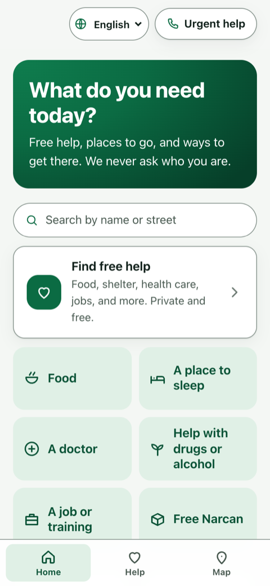
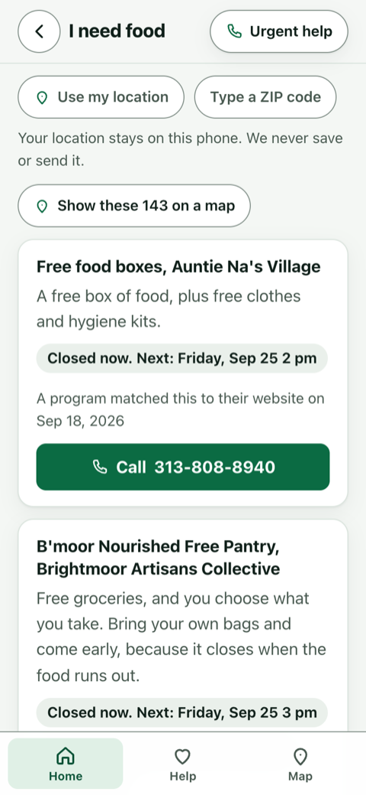
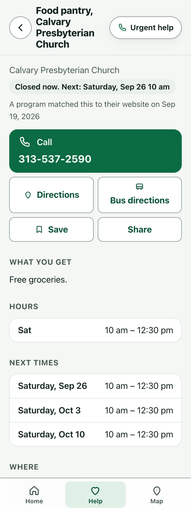
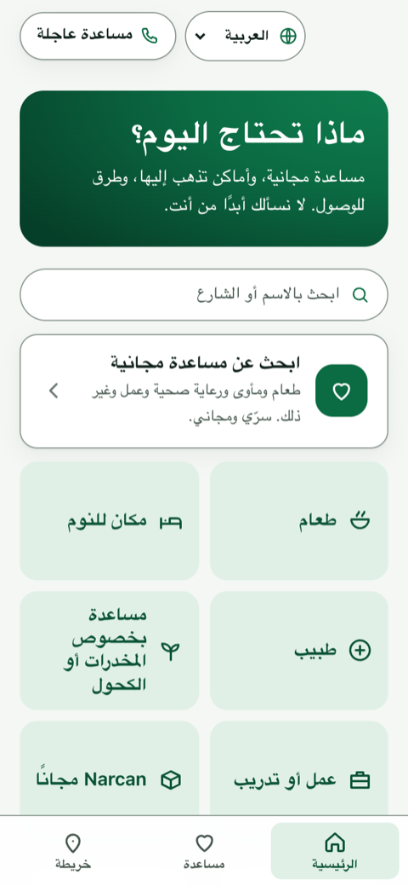
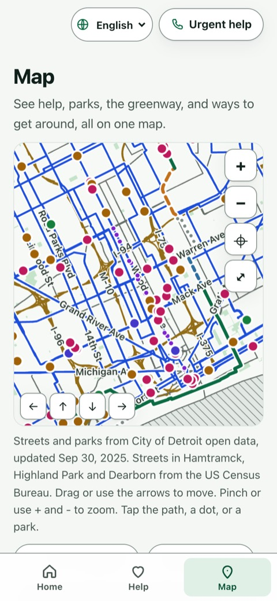
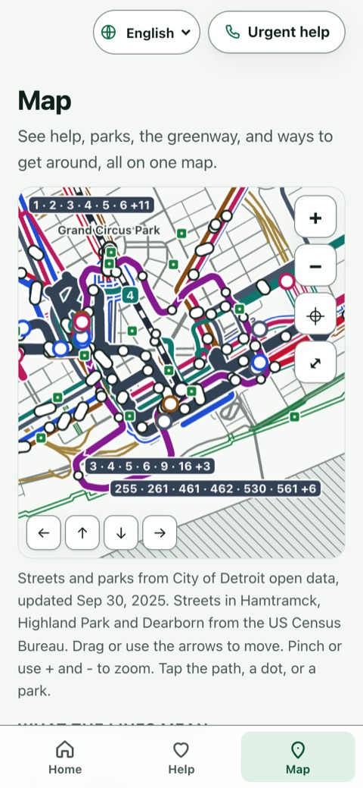
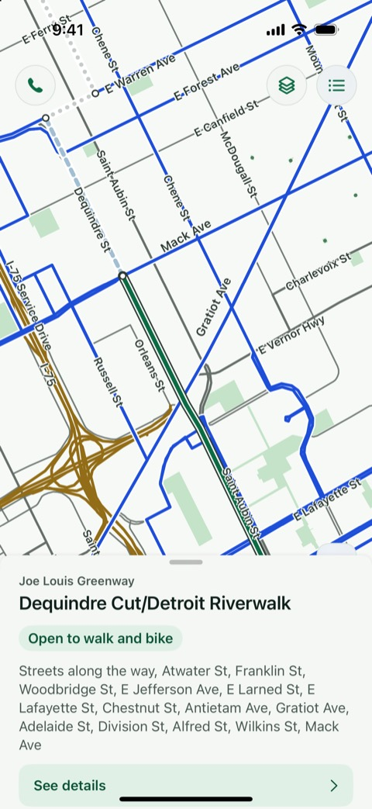
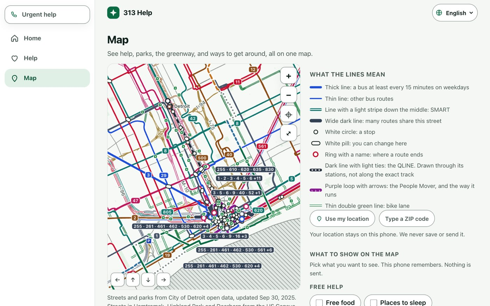

# 313 Help

[](https://github.com/kp2485/313-help/actions/workflows/ci.yml)

Free help, transit, parks and neighborhood facts for Detroit, Hamtramck, Highland Park and Dearborn — in an app that
stores nothing about you, works with no signal, and never sends you to a pantry that closed last month.

**Live at <https://313help.com>** — 531 listings in a release-signed bundle, rebuilt by a nightly publish job.

## Who it is for

| | What they get |
|---|---|
| **Residents who need help** | Food, a bed tonight, clinics, emergency rooms and urgent care, Narcan, treatment, legal help, IDs, jobs, school, rent and utility help — two to four taps, ranked on the phone |
| **Bus and rail riders** | DDOT, SMART, QLINE, People Mover, Amtrak, intercity buses and park-and-ride on one offline map; reduced-fare ID help; one-tap hand-off to a trip planner or the Transit app |
| **Cyclists and MoGo users** | MoGo stations, bike lanes and the Joe Louis Greenway, segment by segment |
| **Families and older adults** | 302 parks, recreation centers, libraries, youth programs, senior meals and rides |
| **Neighbors and block clubs** | A page for each of 205 neighborhoods: help nearby, home sales beside permits, blight, Safe streets |
| **Helpers** | Community health workers, librarians, 211 operators, churches and outreach teams who look things up for someone else — and tell us when a listing is wrong |
| **Spanish, Arabic and Bengali speakers** | The whole interface in four languages; Arabic runs right to left |
| **People using a screen reader, keyboard, switch or large text** | Audited against WCAG 2.2 AA; every map is also a text list |
| **The City, DHD, 211 and anyone who wants the data** | An open HSDS 3.2 dataset in [`data/hsds/`](data/hsds/), CC BY 4.0 |

## Screenshots

<table>
<tr>
<td></td>
<td></td>
<td></td>
<td></td>
</tr>
<tr>
<td></td>
<td></td>
<td></td>
<td></td>
</tr>
</table>



Web PWA at phone and laptop width, and the iPhone app. Every map is drawn on the device from the signed bundle.

## What makes it different

- **It stores nothing.** No accounts, no intake, no analytics — there is no resident data to secure.
- **Freshness is the product.** Every listing shows its dates and a plain badge; nothing says "verified" unless a
  person verified it.
- **The data outlives the app.** The directory is published separately as open data; if the app dies, it doesn't.

## What's in it

- **531 listings** in 44 categories across four cities: 144 food, 91 harm reduction, 79 health (including **9
  emergency rooms and 13 urgent care centers**), 37 jobs, 27 treatment, 27 learning, and 15 more groups.
- **A Map tab drawn on the phone** from City open data and Census TIGER files inside the signed bundle — no tile
  server, no map company, works offline — on web, iPhone and Android. Layers: help by category, 52 greenway
  segments, 302 parks, and **11 transport layers**, with two styles on all three apps: **Standard** and **Subway**
  ([MAP-STYLE](docs/MAP-STYLE.md)). Keyboard: arrows pan, N and P walk the features, Enter opens one.
- **205 neighborhood pages** from public datasets: no rankings, no per-neighborhood crime, small counts suppressed
  ([docs/13](docs/13-neighborhood-indicators.md)).
- **Four languages** — English, Español, العربية, বাংলা — each loaded only when chosen. The native apps follow
  the phone's language list. What a place wrote about itself is never machine-translated.
- **WCAG 2.2 AA audit: 44 pass, 27 found and fixed, 0 open** ([audit](docs/ACCESSIBILITY-AUDIT-2026-09-20.md),
  [test script](docs/ACCESSIBILITY-TEST-SCRIPT.md)).
- **Three clients, one spec.** A web PWA (vanilla TypeScript), an iPhone app (SwiftUI) and an Android app (Kotlin,
  **zero third-party libraries in the APK**). The query rules — open now, next times, badges, ranking — are
  written three times against [one spec](schema/query-spec.md) and **190 shared fixture cases**; all three pass
  every case.
- **Tested and small.** 772 tests in `pnpm test`, 156 in `swift test`, over 120 in Gradle. 81 KB of JavaScript and 8 KB
  of CSS gzipped; a language (20–23 KB) or the Subway style (12 KB) loads only if chosen; the bundle is 2.3 MB.

## How listings stay fresh

A directory is only as good as its worst listing. Full detail: [docs/04](docs/04-resource-lifecycle.md).

1. **Facts come only from the owner's own page**, and a listing publishes only when that page shows its phone and
   street number (`pnpm check:sources`). Exceptions, each documented: domestic-violence lines (phone only, by
   rule), phone-only services, and agency layers that publish a coordinate.
2. **The nightly publish job re-reads every listing's page.** A page that stops matching becomes a steward task;
   the app changes only when a person decides.
3. **Badges say who looked.** "A program matched this to their website on {date}" and "Their website was read and
   matched on {date}" are different sentences, and the build refuses the first for a host known to refuse scripts.
4. **Freshness is computed on the device** from dated facts in the bundle — never frozen at build time.
5. **One-tap anonymous reports** — closed, moved, wrong hours, still open. They label a listing and never hide it.
6. **A steward queue, and nothing deleted.** Only a person archives, with a reason; the link then says "Closed as of {date}."
7. **Unknown is never shown as open.** On a federal holiday a scheduled "open" becomes "Holiday today. Call first."
8. **Emergency numbers match their owners' pages.** 911 and 988 are hardcoded; the other nine are re-checked, and a
   mismatch fails the release build until a person fixes it.
9. **Bundles are Ed25519-signed**; clients pin two keys and refuse anything else.
10. **It never rots silently.** A copy older than 72 hours says so, older than 30 days says "call first," and a
    documented sunset switch points every phone at 211 ([docs/12](docs/12-gift-and-handoff.md)).

The best next improvement is **provider-verified listings** — see the [roadmap](#roadmap).

## Privacy

- No accounts, names, phone numbers, emails or analytics. **No identifier for a resident ever leaves the device.**
- One on-device secret, random and resettable, used only for `sha256(secret ‖ target ‖ day)` so a phone can't
  double-count a report. The server cannot link two reports.
- The Worker never reads an IP address or user-agent, keeps no logs, and rejects any unknown field. Tests enforce it.
- Triage answers live in memory. Location sorts on the phone and is never sent. The map contacts nobody.
- **Domestic-violence shelters never carry an address of any kind.** They sort by a coarse service area ("Serves
  Detroit") and the only action is Call. Those screens, and treatment, crisis and sexual-assault screens, leave no
  URL, history entry, saved item or Share button, and have a quick exit.
- Condition reports are about things, never people. Details: [docs/08](docs/08-privacy-safety.md).

## Quick start

Node 22 and pnpm 12 (`corepack enable`).

```sh
pnpm install
pnpm test                                   # 772 tests
pnpm build:bundle                           # data/seed + data/ingested -> data/hsds + signed data/bundle/v1
pnpm --filter @313help/api migrate:local && pnpm --filter @313help/api dev    # write API on :8787
pnpm --filter @313help/web dev              # app on http://localhost:5173, steward queue at /admin/
```

```
data/seed/        hand-kept CSVs: listings, schedules, emergency numbers     data/hsds/   the open dataset
data/ingested/    open-data layers, committed so a change is a pull request  schema/      query spec + fixtures
pipeline/         ingest, check, validate, sign                              packages/query/  shared rules (TS)
api/  admin/      Cloudflare Worker + D1; the steward queue                  strings/     en, es, ar, bn
apps/web  apps/ios  apps/android    the three clients                        docs/        every decision, and why
```

More: [iPhone](apps/ios/README.md) · [Android](apps/android/README.md) · [design docs](docs/README.md) ·
[operations](docs/OPERATIONS.md) · [deploy runbook](docs/DEPLOY-HANDOFF-2026-09-20.md) ·
[decisions](docs/DECISIONS.md) · [demo](docs/DEMO.md)

## Roadmap

**Now** (the fuller version is [docs/09](docs/09-roadmap.md))
- **Provider-verified listings** — the biggest freshness lever. The owner knows first when hours change; a script
  can only notice that a page changed. A no-account "confirm or fix your listing" flow: a signed link sent to the
  address on the organization's own page, one tap to confirm, and any change held for a steward.
- Native-speaker review of Spanish, Arabic and Bengali, crisis screens first; testing with people who use screen
  readers, switches and large text ([script](docs/ACCESSIBILITY-TEST-SCRIPT.md)).
- App Store and Google Play releases.

**Next**
- Page watchers that open a steward task the day an owner's page changes, and same-day signals — "out of food
  today," warming centers open — in a small signed signals file.
- Partner feeds: Gleaners and Forgotten Harvest schedules, and an HSDS exchange with 211.
- Richer transit: stops in travel order, GTFS-based trip hints — still no tracking.
- Client parity: neighborhood pages and add-a-place in both native apps.
- A steward mobile mode for outreach workers, and coverage passes for thin neighborhoods.

**Later** — photos on condition reports after legal review; local notifications for saved places and alerts;
search in every language; signing-key rotation and revocation; a council-district lens.

### Beyond Detroit: Michigan, then national

The design travels because **a city is a signed bundle plus a service-area config, not a fork**: region id,
bounding box, time zone, holiday calendar, taxonomy labels, and the reference points for DV service areas (which
already include `statewide` and `national`). The data is HSDS, so it interoperates with 211s and state
directories. National sources are already wired — SAMHSA, US DOT NTAD, Census TIGER, GTFS. Zero PII means no
per-state privacy re-engineering, the four-language framework takes more, and each region gets the same steward queue.

1. One region config file and multi-region bundles, with the region picked by ZIP on the device.
2. A second Michigan city as the proof — Flint, Grand Rapids, or Wayne County beyond the four cities.
3. A Michigan-wide base layer from state open data and Michigan 211.
4. A hosted "region in a box" for cities and nonprofits, alongside the open-source gift.
5. A national directory of regional bundles sharing the national hotlines.

**Sustainability:** the code and data stay an open-source gift (about $110 a year to run). Optional hosting and
support contracts fund the rest. Never ads, never data ([docs/12](docs/12-gift-and-handoff.md)).

## Data sources and licences

Most listings come from each organization's own website; more than 150 are named in [NOTICE](NOTICE). Map,
transit, park and neighborhood layers come from City of Detroit open data, Wayne County, SMART, the People Mover,
MDOT, SEMCOG, US Census TIGER, US DOT BTS and SAMHSA. Every listing names its source on screen. Per-source terms
are in `data/sources.yaml`, [docs/02](docs/02-data-sources.md) and [data/LICENSE-DATA.md](data/LICENSE-DATA.md).
**Licence:** code Apache-2.0 ([LICENSE](LICENSE)); our dataset CC BY 4.0; third-party data keeps its publisher's
terms (one file, intercity bus stops, is CC BY-NC 4.0). Contributions carry a DCO sign-off.

**Acknowledgements.** The residents, volunteers, clergy, staff and outreach workers who run the places in this directory, and everyone
who reports a closed door. 313 Help rebuilds the intent of the Detroit Health Department's D Compassion app from
public information. It is an independent project by Kyle Peterson / Linwood Technologies, **not a City of Detroit
product** — the About screen says so in all four languages. Thanks to [313SafeBeds](https://313safebeds.com),
which the shelter screen opens with, and to the agencies and standards bodies credited in [NOTICE](NOTICE).
